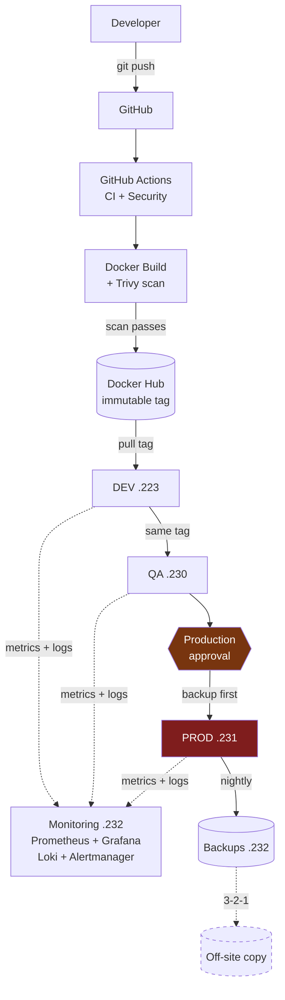
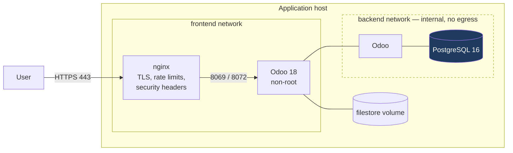
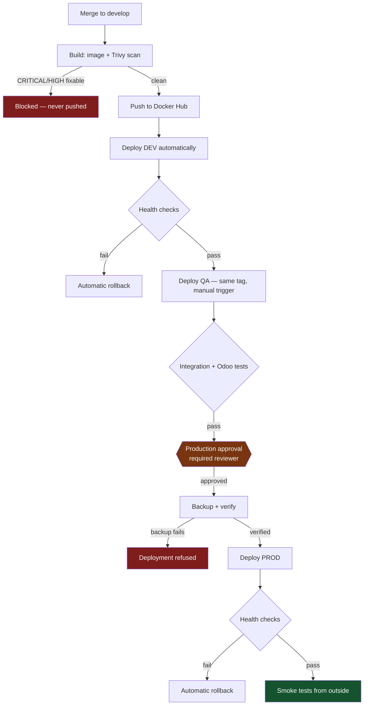
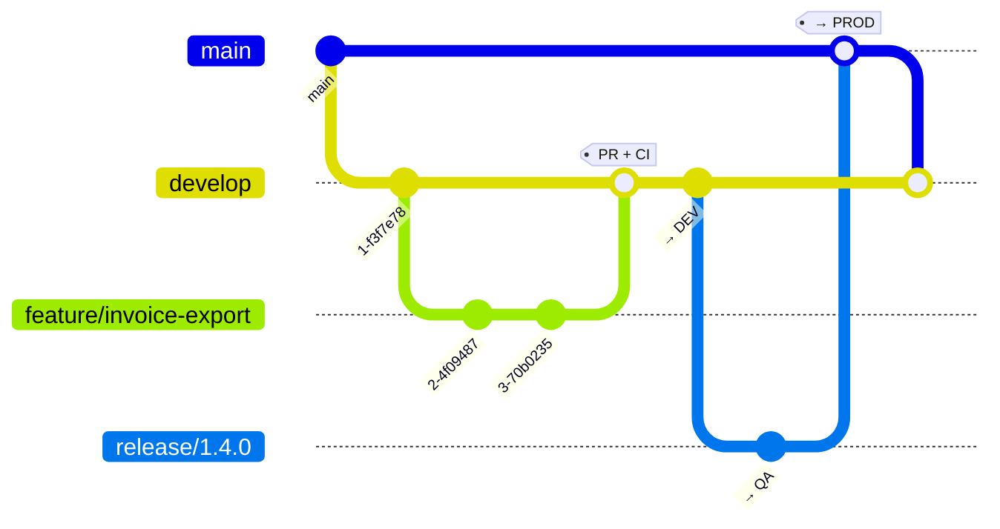

# Odoo Production Platform

Production-grade deployment, operations and observability engineering around
**Odoo 18 Community Edition**: one immutable image promoted DEV → QA → PROD,
verified backups, centralised monitoring and logging, and a deployment path
that rolls itself back when the application fails its health checks.

The emphasis is on the parts that decide whether a system survives contact
with production — recoverability, observability, and the ability to answer
*"what exactly is running?"* with a commit hash.

---

## Contents

- [Architecture](#architecture)
- [Server inventory](#server-inventory)
- [Technology stack](#technology-stack)
- [The core principle](#the-core-principle-build-once-promote-the-same-image)
- [Deployment workflow](#deployment-workflow)
- [Git workflow](#git-workflow)
- [Environment setup](#environment-setup)
- [Security](#security)
- [Monitoring and logging](#monitoring-and-logging)
- [Backup and recovery](#backup-and-recovery)
- [CI/CD](#cicd)
- [Troubleshooting](#troubleshooting)
- [Documentation](#documentation)
- [Current status](#current-status)

---

## Architecture



The dashed off-site copy is **not yet configured** — see
[Current status](#current-status).

### Runtime stack, per application host



nginx is the only ingress. **PostgreSQL publishes no port at all** and sits on
an `internal` Docker network with no route off the host — the single most
common way an Odoo deployment ends up with a publicly readable database.

---

## Server inventory

| Role | Address | Runs | Ingress |
|---|---|---|---|
| **DEV** | `157.10.100.223` | Odoo, PostgreSQL, nginx, exporters | **80/443** |
| **QA / UAT** | `157.10.100.230` | Odoo, PostgreSQL, nginx, exporters | **80/443** |
| **PROD** | `157.10.100.231` | Odoo, PostgreSQL, nginx, exporters | **80/443** |
| **OPS** | `157.10.100.232` | Prometheus, Grafana, Loki, Alertmanager, backups | **80/443** (Grafana only) |

| Service | URL |
|---|---|
| Odoo DEV | <https://157.10.100.223> |
| Odoo QA | <https://157.10.100.230> |
| Odoo PROD | <https://157.10.100.231> |
| Grafana | <https://157.10.100.232> |

**Grafana is the only monitoring service exposed**, and only through nginx with
TLS and a rate-limited login. Prometheus and Alertmanager stay bound to
`127.0.0.1` and are reached over an SSH tunnel — Grafana has real
authentication, and those two have none at all.

Certificates are self-signed until real DNS names exist, so browsers will warn.
Production refuses to configure without a real certificate.

---

## Technology stack

| Layer | Choice | Why |
|---|---|---|
| Application | Odoo 18.0 CE | Pinned to a dated tag, never `latest` |
| Database | PostgreSQL 16 | Tuned for Odoo; WAL archiving on |
| Proxy | nginx 1.31 | TLS termination, rate limiting, security headers |
| Runtime | Docker + Compose v2 | Right complexity for four servers |
| Registry | Docker Hub | Immutable `CalVer-sha` tags |
| CI/CD | GitHub Actions | 6 workflows, protected `production` environment |
| Config mgmt | Ansible | 5 roles, no Kubernetes |
| Metrics | Prometheus | 26 alert rules |
| Dashboards | Grafana | 5 dashboards, 52 panels, provisioned as code |
| Logs | Loki + promtail | Structured, low cardinality |
| Alerting | Alertmanager | Routing verified with `amtool` |
| Security | Trivy, Gitleaks, CodeQL, hadolint | Gated in CI |
| Backup encryption | age | Encrypted at rest |

**Kubernetes was deliberately not used.** Four servers running one application
do not justify a control plane; Docker Compose plus Ansible is easier to
operate and to recover under pressure. See `docs/adr/`.

---

## The core principle: build once, promote the same image

```
   ONE build  →  ONE scan  →  DEV  →  QA  →  PROD
                              ↑       ↑       ↑
                              └───────┴───────┘
                              the identical image digest
```

Nothing is rebuilt per environment. Every difference between DEV, QA and PROD
arrives at runtime through the host's `.env` file.

This is enforced, not merely intended:

- `scripts/deploy.sh` **never builds** — it pulls a tag CI already produced
- it **refuses the tag `latest`**, which is mutable and would break the guarantee
- QA and PROD workflows **verify the tag exists on Docker Hub** before touching anything
- CI **asserts** all three environments resolve to one identical image reference
- the image's `org.opencontainers.image.revision` label is checked against the commit

---

## Deployment workflow



Production deployment **cannot proceed without a verified backup**. That is a
hard gate in `scripts/deploy.sh`, not a checklist item.

```bash
# Deploy a specific tag
./scripts/deploy.sh -e prod -t 2026.09.03-a1b2c3d

# Roll the application back to the previous known-good tag
./scripts/rollback.sh -e prod

# Verify a deployment from outside the containers
./scripts/healthcheck.sh -e prod
```

---

## Git workflow



| Branch | Purpose | Protection |
|---|---|---|
| `main` | Reflects production | PR + CI + review, no direct push |
| `develop` | Integration; deploys to DEV | PR + CI |
| `feature/*` | New work | — |
| `bugfix/*` | Non-urgent fixes | — |
| `release/*` | QA validation | — |
| `hotfix/*` | Urgent production fixes | PR + CI, expedited review |

Full detail in [`docs/git-workflow.md`](docs/git-workflow.md).

---

## Environment setup

### Local development

```bash
git clone https://github.com/rthway/odoo-platform.git
cd odoo-platform

cp .env.dev.example .env
./scripts/gen-secrets.sh dev        # generates strong values; prints to stdout

docker compose -f compose.yml -f compose.dev.yml up -d
docker compose -f compose.yml -f compose.dev.yml exec odoo \
  odoo --config=/etc/odoo/odoo.conf --database=odoo_dev --init=base --stop-after-init

./scripts/healthcheck.sh -e dev
```

Odoo is then on <http://localhost:8080>.

### Provisioning a server

```bash
cd infrastructure/ansible
ansible-galaxy collection install -r requirements.yml
cp inventory/hosts.example.ini inventory/hosts.ini    # edit the SSH user

ansible-playbook site.yml --limit dev --check --diff  # dry run first
ansible-playbook site.yml --limit dev
```

### Running the checks

```bash
./tests/run-all.sh                    # lint, config and security — no Docker needed
./tests/run-all.sh --with-runtime -e dev   # adds smoke and integration tests
```

---

## Security

| Control | Implementation |
|---|---|
| Secret scanning | Gitleaks over **full history** on every PR |
| Static analysis | CodeQL (`security-and-quality`) |
| Image scanning | Trivy **before push** — a failing image never reaches the registry |
| Dependency review | Blocks new high-severity dependencies in PRs |
| Container user | Non-root (`USER odoo`), asserted in CI |
| Database exposure | No published port, `internal` network |
| Database manager | `list_db=False`, plus nginx blocks `/web/database/*` |
| Secrets at rest | GitHub Environment Secrets → Ansible → `.env` at `0600` |
| SSH | Keys only, no root login, fail2ban |
| Firewall | ufw default-deny; exporters reachable only from OPS |
| TLS | 1.2/1.3, HSTS, Let's Encrypt |
| Backups | Encrypted with age |

**Vulnerability policy** — CRITICAL blocks always; HIGH blocks when a fix
exists; unfixable upstream CVEs are tracked and reviewed weekly rather than
blocking every build. Detail in [`docs/security.md`](docs/security.md).

The entrypoint **refuses to start** with `list_db=True` outside
`ENVIRONMENT=dev`, so a misconfigured `.env` cannot expose the database
manager in QA or production.

---

## Monitoring and logging

Five Grafana dashboards, provisioned as code and not UI-editable:

1. **Infrastructure** — CPU, memory, disk, load, network, I/O across all four servers
2. **Containers** — per-container CPU, memory, restarts, filesystem
3. **PostgreSQL** — connections, size, transactions, locks, cache, WAL archiving
4. **Odoo** — availability, response time, HTTP status, certificate expiry, live logs
5. **Backup** — freshness, size, duration, and verified-restore evidence

26 alert rules across availability, resources, containers, PostgreSQL, backup,
TLS and monitoring integrity — including one that fires when Alertmanager
itself is unreachable, because a dead Alertmanager otherwise silences
everything while looking healthy.

```bash
# Grafana binds to localhost on OPS; reach it over a tunnel
ssh -L 3000:127.0.0.1:3000 <user>@157.10.100.232
```

Logs from Odoo, PostgreSQL, nginx and the hosts go to Loki. Odoo tracebacks
are collapsed into a single entry rather than 40 fragments.

---

## Backup and recovery

An Odoo backup is **two things taken together** — the PostgreSQL database and
the filestore on disk. Restoring one without the other yields a database full
of broken attachments.

| | |
|---|---|
| Schedule | Daily 02:15 UTC |
| Contents | Database (`pg_dump -Fc`), filestore, configuration |
| Encryption | age |
| Retention | 14 daily, 8 weekly, 12 monthly (production) |
| Integrity | SHA-256 manifest verified after every backup |
| **Restore test** | **Weekly, into a throwaway container** |
| Off-site | ⚠ Not yet configured |

```bash
./scripts/backup.sh -e prod -l manual
./scripts/verify-backup.sh -s <set> --restore    # the check that actually counts
./scripts/restore.sh -e qa -s <set>              # rehearse on QA, never prod
```

**Application rollback and database rollback are separate problems.**
`rollback.sh` reverts the image only and says so loudly: Odoo schema
migrations are one-way, so after a migration an image rollback leaves old code
facing a new schema. That case is an incident, not a rollback — see
[`docs/disaster-recovery.md`](docs/disaster-recovery.md).

---

## CI/CD

| Workflow | Trigger | Does |
|---|---|---|
| `ci.yml` | PR, push | Lint, config assertions, Ansible, tests, real Odoo integration |
| `security.yml` | PR, push, weekly | Gitleaks, CodeQL, Trivy, dependency review |
| `build.yml` | Push to develop/main, tags | Build, verify labels, scan, push, attest provenance |
| `deploy-dev.yml` | Automatic after Build | Deploy + smoke test |
| `deploy-qa.yml` | Manual | Same tag + integration and Odoo tests |
| `deploy-prod.yml` | Manual + **approval** | Backup, deploy, migrate, verify, roll back on failure |
| `provision.yml` | Manual | Runs Ansible from a Linux runner; dry run by default |

The CI integration job runs a **full backup and restore round trip** on every
pull request, so the recovery path is exercised continuously rather than first
tested during an incident.

The Docker daemon is never exposed to GitHub Actions. Runners open an SSH
session and the server pulls its own image.

---

## Troubleshooting

| Symptom | Start here |
|---|---|
| Odoo is down | [`docs/runbooks/application-down.md`](docs/runbooks/application-down.md) |
| Database unreachable | [`docs/runbooks/database-unavailable.md`](docs/runbooks/database-unavailable.md) |
| Disk filling | [`docs/runbooks/disk-full.md`](docs/runbooks/disk-full.md) |
| High CPU / slow | [`docs/runbooks/high-cpu.md`](docs/runbooks/high-cpu.md) |
| Backup failed | [`docs/runbooks/backup-failed.md`](docs/runbooks/backup-failed.md) |
| Certificate expired | [`docs/runbooks/certificate-expired.md`](docs/runbooks/certificate-expired.md) |
| Need to restore | [`docs/runbooks/restore-database.md`](docs/runbooks/restore-database.md) |

---

## Documentation

| Document | Covers |
|---|---|
| [`architecture.md`](docs/architecture.md) | Components, networks, data flow, trust boundaries |
| [`infrastructure.md`](docs/infrastructure.md) | Servers, ports, capacity |
| [`git-workflow.md`](docs/git-workflow.md) | Branching, protection, release process |
| [`development.md`](docs/development.md) | Local setup, addon development, testing |
| [`docker.md`](docs/docker.md) | Image strategy, compose layering, tagging |
| [`ci-cd.md`](docs/ci-cd.md) | Pipelines, gates, secrets, environments |
| [`security.md`](docs/security.md) | Controls, vulnerability policy, secret rotation |
| [`monitoring.md`](docs/monitoring.md) | Metrics, dashboards, alert rules |
| [`logging.md`](docs/logging.md) | Loki, promtail, useful queries |
| [`backup.md`](docs/backup.md) | Strategy, schedule, retention, 3-2-1 |
| [`disaster-recovery.md`](docs/disaster-recovery.md) | RPO/RTO, scenarios, procedures |
| [`deployment.md`](docs/deployment.md) | Promotion, approvals, migrations |
| [`rollback.md`](docs/rollback.md) | What rollback does and does not undo |
| [`troubleshooting.md`](docs/troubleshooting.md) | Symptom-driven diagnosis |
| [`incident-response.md`](docs/incident-response.md) | Severity, roles, communication |
| [`runbook.md`](docs/runbook.md) | Every routine operation, with real commands |

Design decisions and their trade-offs are recorded in [`docs/adr/`](docs/adr/).

---

## Current status

Honest account of what is proven and what is not.

### Verified by the live pipeline

The GitHub Actions pipelines run on every push and are **green**. The
integration job is the substantive one: it builds the image, runs real Odoo
against real PostgreSQL behind real nginx, and exercises the recovery path.

| Evidence | Result |
|---|---|
| Image builds, Odoo starts, registry loads | `/web/login` → **200** |
| Health checks | HEALTHY — containers, restarts, DB query, HTTP |
| Smoke tests | **15 passed, 0 failed** |
| Security headers present, nginx version hidden | pass |
| Database manager blocked | **404** |
| Backup from a real database | 1.1 MB dump + 677 KB filestore, checksums verified |
| **Restore into a throwaway container** | **123 tables, 7 users, 12 installed modules — in 2s** |
| Trivy image scan + CRITICAL/HIGH policy gate | pass |
| OCI revision label matches the commit | pass |
| Container does not run as root | pass |
| Gitleaks over full history | **no secrets found** |
| Trivy filesystem/config/secret scan | pass |
| Ansible syntax check + ansible-lint | pass |

Validated locally with the real tools: `promtool` (26 alert rules, 57
dashboard expressions), `amtool` (config plus **10/10 routing cases**),
`actionlint` with shellcheck, `shellcheck`, and 41 assertions in
`tests/run-all.sh` — negative-tested so they cannot pass vacuously.

### Repository

- Published at <https://github.com/rthway/odoo-platform>
- `main` and `develop` protected: PR required, **CI passed** and
  **Security passed** required, 1 approval, stale reviews dismissed, force
  pushes and deletions blocked
- Environments `dev`, `qa` and `production` created; **production requires a
  reviewer** and accepts deployments only from protected branches

### Not yet done

Nothing has been deployed to a server.

```
SSH        no key available; root refused on .223/.230/.231/.232.
           Blocks the infrastructure audit, all deployments,
           monitoring and backups.
Docker Hub DOCKERHUB_USERNAME/TOKEN not set, so images are built and
           scanned on every push but NOT published. Nothing is
           deployable until they exist.
Servers    never audited, never provisioned, never deployed to.
Monitoring config validated, but no target has ever been scraped and
           no alert has ever fired.
Off-site   BACKUP_OFFSITE_TARGET unset - 3-2-1 is NOT satisfied.
SonarQube  not deployed.
CodeQL     correctly skipped until addons/ contains Python.
DNS/TLS    no domain; DEV and QA use self-signed certificates.
Rehearsals rollback, production restore and PITR have never been run
           against real infrastructure.
```

The ordered steps to close each of these are in
[`docs/runbook.md`](docs/runbook.md#bringing-the-platform-online).

## Licence

LGPL-3.0-or-later, matching Odoo Community Edition.
