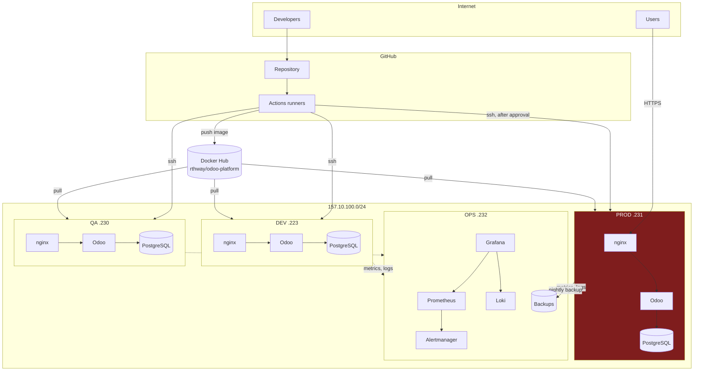

# Architecture

## Component overview



## Trust boundaries

There are four, and each is enforced by a different mechanism.

| Boundary | Enforced by |
|---|---|
| Internet → nginx | ufw (80/443 only), TLS, rate limiting |
| nginx → Odoo | Docker `frontend` network; Odoo publishes no host port |
| Odoo → PostgreSQL | Docker `backend` network, marked `internal` |
| OPS → exporters | ufw source restriction to `157.10.100.232` |

The `backend` network being `internal` means containers on it have **no route
off the host at all**. A compromised Odoo worker cannot exfiltrate the
database over the network, only through nginx.

## Request path

```
User
  │ HTTPS 443
  ▼
nginx  ── TLS termination
       ── security headers (HSTS, nosniff, frame options)
       ── rate limit: 6 req/min on /web/login, 30 req/s general
       ── /web/database/* → 404, unconditionally
       ── static assets cached 7 days
  │ HTTP 8069 (or 8072 for websockets)
  ▼
Odoo   ── proxy_mode=True, so it trusts X-Forwarded-Proto
       ── dbfilter pins it to exactly one database
  │ 5432, backend network only
  ▼
PostgreSQL
```

Two independent controls block the database manager: `list_db=False` in
`odoo.conf`, and the nginx location block. Either alone would be sufficient;
both together mean a single misconfiguration is not an exposure.

## Data flow

| Data | Lives in | Backed up | Survives redeploy |
|---|---|---|---|
| Business records | PostgreSQL `db-data` volume | Yes, `pg_dump -Fc` | Yes |
| Attachments | Odoo `odoo-filestore` volume | Yes, tar | Yes |
| WAL segments | `wal-archive` volume | Archive target | Yes |
| Sessions | filestore | Incidentally | Yes |
| Application code | Container image | Image is in the registry | Replaced |
| Configuration | `.env` on the host | Rendered by Ansible | Yes |
| Logs | Docker json-file → Loki | No (30-day retention) | No |

The database holds *references* to filestore objects; the filestore holds the
bytes. This is why `backup.sh` captures both, and captures the filestore first
— Odoo writes the file before committing the row, so a file with no row is
harmless while a row with no file is a broken attachment.

## Environment separation

| | DEV | QA | PROD |
|---|---|---|---|
| Project name | `odoo-dev` | `odoo-qa` | `odoo-prod` |
| Database | `odoo_dev` | `odoo_qa` | `odoo_prod` |
| Workers | 0 (threaded) | 3 | 5 |
| `list_db` | True | **False** | **False** |
| Addons from | host bind mount | **image only** | **image only** |
| Log level | debug | info | warn |
| Deployment | automatic | manual | **manual + approval** |

QA deliberately mirrors production's configuration rather than DEV's. A
rehearsal in a differently-configured environment is not a rehearsal.

CI asserts these differences on every pull request; see the `config` job in
`.github/workflows/ci.yml`.

## Why not Kubernetes

Four servers, one application, one team. A control plane would add etcd,
an ingress controller, a CNI and a new failure domain, in exchange for
scheduling flexibility this workload does not need. Compose plus Ansible is
recoverable at 3am by someone reading a runbook. Recorded in
[`adr/008-no-terraform.md`](adr/008-no-terraform.md).
