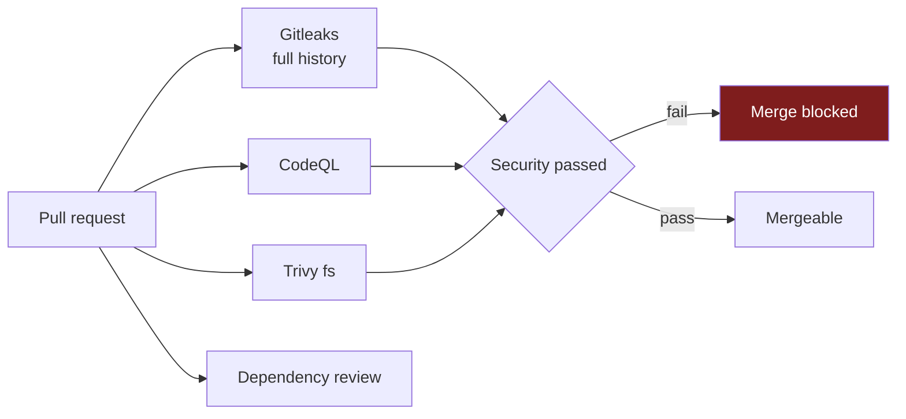

# CI/CD

## Pipelines

| Workflow | Trigger | Blocking |
|---|---|---|
| `ci.yml` | PR, push to main/develop | Yes — `CI passed` |
| `security.yml` | PR, push, weekly cron | Yes — `Security passed` |
| `build.yml` | Push to develop/main, tags | Produces the artifact |
| `deploy-dev.yml` | After a successful Build on develop | — |
| `deploy-qa.yml` | Manual | — |
| `deploy-prod.yml` | Manual + **approval** | — |
| `provision.yml` | Manual | Runs Ansible against a host |

`provision.yml` exists because **Ansible has no Windows control node**, so
provisioning cannot run from an operator's workstation here. Rather than
require a separate Linux jump box, the pipeline is the control node: a Linux
runner, the same per-environment deploy keys, and secrets that never touch a
shared disk.

It **defaults to `--check --diff`** — applying has to be asked for explicitly
— and targeting `production` goes through that environment's required
reviewer, exactly as a deployment does.

## CI jobs

| Job | Checks |
|---|---|
| `lint` | shellcheck, yamllint, hadolint, actionlint, executable bits |
| `config` | All three overlays resolve; **environment isolation assertions** |
| `ansible` | `--syntax-check` and ansible-lint (only possible on Linux) |
| `test` | `tests/run-all.sh` |
| `integration` | Builds the image, runs real Odoo + PostgreSQL, smoke tests, **backup/restore round trip** |

The isolation assertions are the important ones. They fail the build if:

- two environments share a database name or project name
- QA or PROD has `list_db=True`
- QA or PROD bind-mounts anything from the host
- any environment publishes a database port
- the three environments resolve to different image references

These are properties a reviewer cannot reliably eyeball on a large diff, so
they are asserted rather than reviewed.

## Security gates



Gitleaks runs with `fetch-depth: 0`. A secret committed and removed in a later
commit is **still in the history and still compromised**; a shallow clone
would miss exactly that case.

CodeQL is guarded by a language-detection job: it errors out when a language
has no sources, and `addons/` is empty until the first custom module lands.
The aggregate job accepts `skipped` for CodeQL alone.

## Build gates

```
build (local, not pushed)
  -> verify the OCI revision label equals the commit SHA
  -> verify the image does not run as root
  -> Trivy SARIF into the Security tab
  -> Trivy policy gate: fixable CRITICAL/HIGH fails the build
  -> SBOM (CycloneDX)
  -> push to Docker Hub
  -> attest build provenance
```

The image is built locally and pushed only after every gate passes. An image
that fails its scan never exists in the registry, so nobody can deploy it by
hand later.

## Deployment security

The Docker daemon is **never** exposed to GitHub Actions. The runner opens an
SSH session and the server pulls its own image:

```
runner --ssh--> host --> ./scripts/deploy.sh --> docker pull
```

`StrictHostKeyChecking=yes` with pinned `SSH_KNOWN_HOSTS`. Without it, a
deployment could be silently redirected to another host.

## Secrets and variables

Per environment, under **Settings → Environments**:

| Environment | Secrets | Reviewers |
|---|---|---|
| `dev` | `SSH_HOST`, `SSH_USER`, `SSH_PRIVATE_KEY`, `SSH_KNOWN_HOSTS` | None |
| `qa` | the same four, QA values | None |
| `production` | the same four, PROD values | **Required** |

Repository level: `DOCKERHUB_USERNAME` and `DOCKERHUB_TOKEN`. The token must
be a Docker Hub **access token** scoped read/write, never the account
password, so it can be revoked without changing the account.

Variables: `DOCKERHUB_NAMESPACE`, `APP_DIR`, `DEV_URL`, `QA_URL`, `PROD_URL`.

Production secrets live in the `production` environment, so a workflow run
targeting `dev` cannot read them.

## Configured state

Set up and verified on 2026-09-03:

| | Value |
|---|---|
| `DOCKERHUB_USERNAME` / `DOCKERHUB_TOKEN` | set; Build publishes successfully |
| `DOCKERHUB_NAMESPACE` | `rthway` |
| `APP_DIR` | `/opt/odoo-platform` |
| `DEV_URL` / `QA_URL` / `PROD_URL` | the three hosts |
| `dev` / `qa` / `production` environments | `SSH_HOST`, `SSH_USER`, `SSH_PRIVATE_KEY`, `SSH_KNOWN_HOSTS` |

Each environment has its **own** deploy key (`github-actions-dev`, `-qa`,
`-prod`), generated for this purpose and installed into
`~devops/.ssh/authorized_keys` on the matching host. No personal key is used
for deployment, and compromising one environment's key does not grant access
to the others. All three were verified to authenticate before the secrets
were set.

`SSH_KNOWN_HOSTS` holds each host's real ed25519 key, collected with
`ssh-keyscan`, so `StrictHostKeyChecking=yes` has something to check against.

> Rebuilding a host regenerates its SSH host key and wipes
> `authorized_keys`. After any rebuild, reinstall that environment's deploy
> public key and refresh its `SSH_KNOWN_HOSTS` secret, or its deployments
> will fail host-key verification.

First published image: `rthway/odoo-platform:2026.09.03-64976d2`
(643 MB, digest `sha256:ffe6b5cf…`), together with `sha-64976d2` and
`latest`.

## Setting it up

```bash
gh secret set DOCKERHUB_USERNAME
gh secret set DOCKERHUB_TOKEN

for env in dev qa production; do
  gh api -X PUT "repos/:owner/:repo/environments/$env"
  gh secret set SSH_HOST        --env "$env"
  gh secret set SSH_USER        --env "$env"
  gh secret set SSH_PRIVATE_KEY --env "$env"
  gh secret set SSH_KNOWN_HOSTS --env "$env"
done
```

Required reviewers on `production` are set in the web UI, or via the API with
a `reviewers` payload.

Collect the value for `SSH_KNOWN_HOSTS` with:

```bash
ssh-keyscan -t ed25519 157.10.100.231
```

## Deployment keys

Generate a dedicated key per environment. Never reuse a personal key, and
never commit a private key.

```bash
ssh-keygen -t ed25519 -C "github-actions-prod" -f ./deploy_prod -N ""

# public half onto the server
ssh-copy-id -i ./deploy_prod.pub deploy@157.10.100.231

# private half into the environment secret, then destroy the local copy
gh secret set SSH_PRIVATE_KEY --env production < ./deploy_prod
shred -u ./deploy_prod ./deploy_prod.pub
```

## SonarQube

Not yet deployed. When it is, add a `sonarqube` job to `ci.yml` **and add it
to the `ci-passed` needs list** — otherwise the quality gate is advisory and
blocks nothing, which is the usual way a quality gate ends up decorative.
