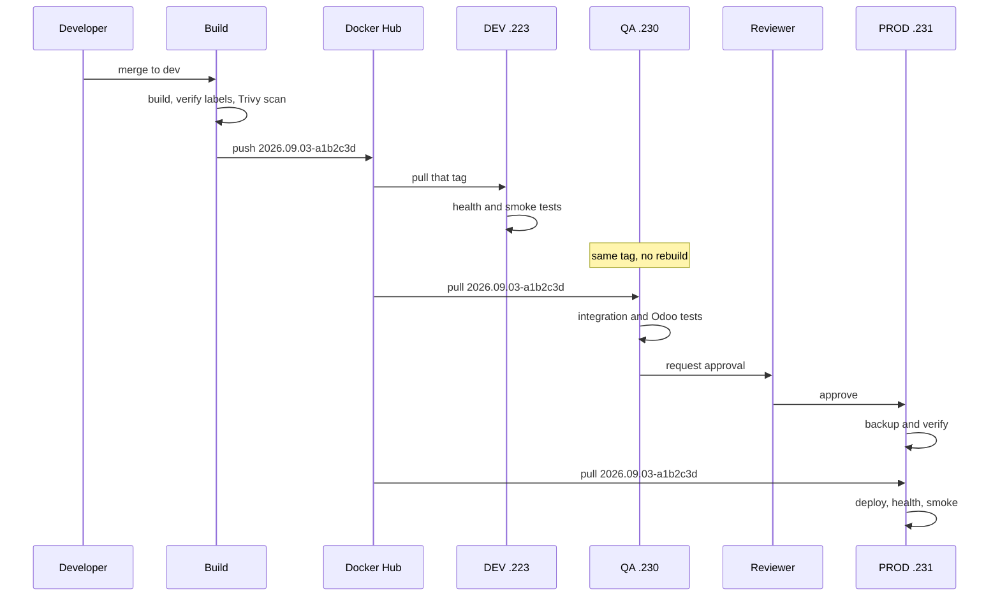

# Deployment

## The rule

**Build once, scan once, promote the same image.** Nothing is rebuilt per
environment. Every environmental difference comes from the host's `.env` file.

## Promotion



## DEV

Automatic on every successful Build from `dev`. To deploy a chosen tag:

```bash
gh workflow run deploy-dev.yml -f image_tag=2026.09.03-a1b2c3d
```

## QA

Manual, with the tag DEV validated:

```bash
gh workflow run deploy-qa.yml -f image_tag=2026.09.03-a1b2c3d
```

The workflow confirms the tag exists on Docker Hub before touching QA, so a
typo fails in seconds rather than half-way through a deployment.

QA then runs integration tests, plus Odoo's own test suite against a
**throwaway clone** of the QA database rather than the live one — the test
runner writes, and leaving test records behind would stop QA being a faithful
rehearsal of production.

It also confirms from outside that the database manager returns 404.

## Production

```bash
gh workflow run deploy-prod.yml \
  -f image_tag=2026.09.03-a1b2c3d \
  -f run_migration=false
```

Then approve under **Actions → the run → Review deployments**.

The sequence:

1. **Pre-flight**, before the approval prompt, so the reviewer is approving
   something already checked: the tag exists, it is not `latest`, digest resolved
2. **Approval** on the protected `production` environment
3. **Record the current tag**, captured before anything changes, so the
   rollback target is known even if later steps fail oddly
4. **Backup and verify** — a failure here aborts the deployment
5. **Deploy** — `deploy.sh` pulls before stopping anything, so an unreachable
   registry cannot cause an outage
6. **Migration**, only if requested
7. **Health checks** — failure triggers an automatic rollback
8. **External smoke tests** — the login page serves, the database manager is
   blocked, HSTS is present

## Migrations

```bash
gh workflow run deploy-prod.yml \
  -f image_tag=2026.09.03-a1b2c3d \
  -f run_migration=true \
  -f migration_modules=sale,stock
```

> **Odoo migrations are one-way.** There is no `odoo --downgrade`. Once a
> migration has run, rolling the image back leaves old code facing a new
> schema. Read [`rollback.md`](rollback.md) before setting this to true.

`migrate.sh` requires a verified backup **less than 60 minutes old** for
production. A backup taken hours earlier is not a rollback point for a
migration running now — every transaction in between would be lost.

## Manual deployment

For incidents only, when GitHub is unavailable.

```bash
ssh deploy@157.10.100.231
cd /opt/odoo-platform
./scripts/deploy.sh -e prod -t 2026.09.03-a1b2c3d
```

`deploy.sh` still enforces the backup, the health gate and the automatic
rollback. It also refuses to run when the host's `.env` names a different
environment than `-e` — which is what stops a QA deployment landing on the
production host.

## What is running right now?

```bash
ssh deploy@157.10.100.231 'cat /opt/odoo-platform/.deploy-state/current'
ssh deploy@157.10.100.231 'tail -20 /opt/odoo-platform/.deploy-state/history.log'
```

The history log records tag, digest, previous tag and backup set for every
deployment. That is the audit trail that makes "what changed?" answerable
during an incident rather than a guess.
