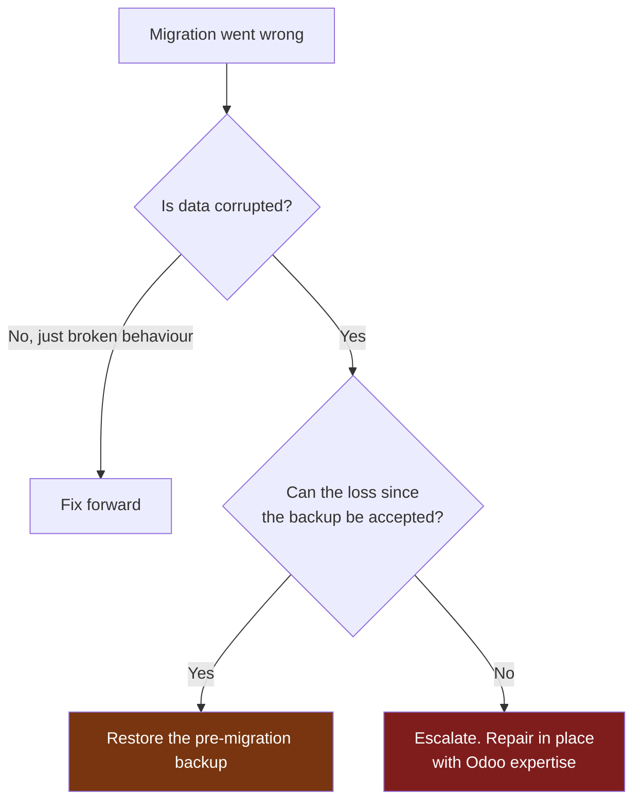
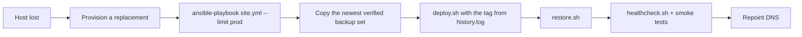

# Disaster recovery

## Objectives

| | Target | Basis |
|---|---|---|
| **RPO** (data loss) | ≤ 24 hours | Daily backup at 02:15 UTC |
| **RPO** with WAL replay | ≤ 5 minutes | `archive_timeout = 300` |
| **RTO** (time to restore) | ≤ 2 hours | Estimated; see below |

> **These are targets, not measurements.** The RTO will only be real once a
> full recovery has been rehearsed end to end. `verify-backup.sh --restore`
> records the *database* restore duration weekly, which is the largest single
> component but not the whole picture — provisioning, filestore extraction and
> verification all add to it.

Improving the RPO below 24 hours means more frequent backups or streaming
replication. That is a cost decision, and it should be made deliberately
rather than discovered during an outage.

## Scenarios

| # | Scenario | Recovery | Data loss |
|---|---|---|---|
| 1 | Bad deployment | Image rollback | None |
| 2 | Bad migration | Fix forward, or restore | None, or since backup |
| 3 | Database corruption | Restore from backup | Since last backup |
| 4 | Filestore loss | Restore filestore | Attachments since backup |
| 5 | Host failure | Rebuild + restore | Since last backup |
| 6 | Ransomware / compromise | Rebuild from clean media + restore | Since last clean backup |
| 7 | Site loss | **Requires an off-site copy** | ⚠ Currently unrecoverable |

Scenario 7 has no recovery path today. See [`backup.md`](backup.md#3-2-1).

## Scenario 1 — bad deployment

```bash
ssh deploy@157.10.100.231
cd /opt/odoo-platform
./scripts/rollback.sh -e prod --reason "<what went wrong>"
```

`deploy.sh` usually does this automatically. See [`rollback.md`](rollback.md).

## Scenario 2 — bad migration

An Odoo migration cannot be reversed. Decide explicitly:



The pre-migration backup path is in `.deploy-state/history.log`:

```bash
grep MIGRATION /opt/odoo-platform/.deploy-state/history.log | tail -5
```

To restore it, accepting the loss:

```bash
./scripts/restore.sh -e prod -s <backup-set> --i-understand-this-destroys-prod
```

That flag is required, **and** the script prompts for the database name to be
typed. It fails closed with no TTY, so it cannot run unattended from cron
or CI.

## Scenario 3 — database corruption

```bash
# 1. Stop serving. Do not let users write into a corrupt database.
cd /opt/odoo-platform
docker compose -f compose.yml -f compose.prod.yml stop odoo proxy

# 2. Preserve the evidence before changing anything.
docker compose -f compose.yml -f compose.prod.yml exec -T db \
  pg_dump -U odoo_prod -d odoo_prod -Fc > /var/backups/odoo/corrupt-$(date +%s).dump

# 3. Choose the most recent VERIFIED set.
ls -1dt /var/backups/odoo/prod/*/ | head -5
./scripts/verify-backup.sh -s <set> --restore

# 4. Restore.
./scripts/restore.sh -e prod -s <set> --i-understand-this-destroys-prod
```

`restore.sh` takes a safety backup of the current state first. Restoring the
wrong set is a routine human error, and without that step the mistake is
unrecoverable.

## Scenario 5 — total host loss



```bash
# 1. Provision
cd infrastructure/ansible
ansible-playbook site.yml --limit prod --check    # review first
ansible-playbook site.yml --limit prod

# 2. Recover the backup from OPS
scp -r deploy@157.10.100.232:/var/backups/odoo/prod/<set> /var/backups/odoo/prod/

# 3. Deploy the tag that was running, from the history log
./scripts/deploy.sh -e prod -t <tag>

# 4. Restore data
./scripts/restore.sh -e prod -s <set> --i-understand-this-destroys-prod

# 5. Verify before sending users back
./scripts/healthcheck.sh -e prod
./tests/test-smoke.sh -e prod
./tests/test-integration.sh -e prod
```

The image tag matters: restoring a database that was migrated by version N
into an environment running version N-1 reproduces the migration problem.

## Scenario 6 — compromise

Additional constraints:

1. **Do not reuse the host.** Rebuild on new infrastructure.
2. **Do not trust recent backups.** Identify when the compromise began and
   restore from before it. This is what monthly retention is for.
3. **Rotate every credential** — see [`security.md`](security.md).
4. Preserve disk images and logs before wiping, for investigation.
5. Review Loki for the intrusion path before reopening access.

## Point-in-time recovery

WAL archiving is enabled (`archive_mode = on`, `archive_timeout = 300`), so
recovery to a specific moment is possible in principle — this is what turns a
24-hour RPO into roughly 5 minutes.

```
base backup + WAL segments  ->  recovery_target_time
```

> **Not yet exercised.** WAL archiving is configured but PITR has never been
> tested here, so it must not be relied on until it has. The documented RPO
> stays at 24 hours until a PITR rehearsal succeeds on QA.

## Rehearsal schedule

| Exercise | Frequency | Status |
|---|---|---|
| Automated restore verification | Weekly | Configured, never run |
| Full recovery rehearsal on QA | Quarterly | **Never performed** |
| PITR rehearsal | Twice yearly | **Never performed** |
| Rollback rehearsal | Each release | **Never performed** |

Disaster recovery is **not complete** until these have actually run. Nothing
in this document should be read as a guarantee until the corresponding row
says so.

## Contacts

To be filled in before production go-live:

| Role | Name | Contact |
|---|---|---|
| Platform owner | | |
| Database escalation | | |
| Infrastructure provider | | |
| Odoo functional lead | | |
