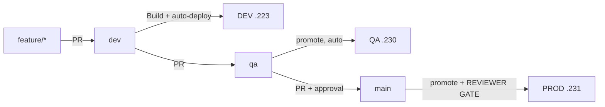

# Git workflow

## Branches

Three permanent branches, one per environment. The branch IS the record of
what that environment runs.

| Branch | Deploys to | Server | Protected |
|---|---|---|---|
| `dev` | DEV | 157.10.100.223 | Yes |
| `qa` | QA / UAT | 157.10.100.230 | Yes |
| `main` | PRODUCTION | 157.10.100.231 | Yes |
| `feature/*` | — | — | No |
| `bugfix/*` | — | — | No |
| `hotfix/*` | PROD (expedited) | — | No |

Monitoring (157.10.100.232) has no branch of its own: it serves every
environment and is provisioned from `main`.

`main` always reflects what is in production. If they diverge, `main` is
wrong and that is an incident in itself — the whole audit trail depends on
that correspondence.

## One artifact, promoted

Only `dev` builds images. `qa` and `main` promote the artifact `dev`
produced; they never rebuild it.

That is the whole guarantee: **the image production runs is the exact image
QA tested**, byte for byte, not a rebuild of the same source. A rebuild can
differ — a base image moves, a transitive dependency publishes, a cache
misses — and then production runs something no one tested.

Merging into `qa` or `main` creates a new commit that Build never saw, so
there is no image tagged for it. The deploy workflows walk back through
ancestors to the newest commit that DOES have a published `sha-<short>`
image, and promote that. If none exists in the last 50 commits, the deploy
fails rather than building one.



## Normal flow

```bash
git switch dev && git pull
git switch -c feature/invoice-export
# ... work ...
git push -u origin feature/invoice-export
gh pr create --base dev
```

Merging to `dev` triggers Build, then an automatic DEV deployment.

## Promoting

```bash
# DEV looks good -> QA
gh pr create --base qa --head dev --title "Promote to QA"
# merge; Deploy QA runs on push and resolves the tag DEV built

# QA passed -> PRODUCTION
gh pr create --base main --head qa --title "Promote to production"
# merge; Deploy PROD runs, then PARKS at the production reviewer gate
```

Merging to `main` asks for a production deployment. It does not perform one:
the deploy job binds the `production` environment, so the run waits for a
required reviewer exactly as a manual dispatch does.

Tag the release once it is live:

```bash
git switch main && git pull
git tag -a v1.4.0 -m "Release 1.4.0" && git push origin v1.4.0
```

## Hotfixes

```bash
git switch -c hotfix/1.4.1-session-fix main
# fix, test, push
gh pr create --base main
```

After merging to `main`, **merge it back down into `qa` and `dev`**
immediately. A hotfix that exists only on `main` is silently reverted by the
next promotion.

A hotfix branch never passed through `dev`, so no image was built for it.
Run **Build** manually (`workflow_dispatch`) on the hotfix branch first, or
the production deploy will find no artifact to promote and refuse.

## Branch protection

Configure on `main`, `qa` and `dev`:

- Require a pull request
- Require the status checks **CI passed** and **Security passed**
- Require branches to be up to date before merging
- Require at least one approving review
- Dismiss stale approvals on new commits
- Restrict force pushes and deletion

Repeat for each branch (`main`, `qa`, `dev`):

```bash
# `strict` and the review counts are BOOLEANS and NUMBERS. Passing them with
# -f sends strings, and the API rejects the whole request with
# `"true" is not a boolean` - so send a JSON body instead.
cat > /tmp/protection.json <<'JSON'
{
  "required_status_checks": {
    "strict": true,
    "contexts": ["CI passed", "Security passed"]
  },
  "enforce_admins": true,
  "required_pull_request_reviews": {
    "required_approving_review_count": 1,
    "dismiss_stale_reviews": true
  },
  "restrictions": null,
  "allow_force_pushes": false,
  "allow_deletions": false
}
JSON

for b in main qa dev; do
  gh api -X PUT "repos/:owner/:repo/branches/$b/protection" --input /tmp/protection.json
done
```

`CI passed` and `Security passed` are aggregate jobs. Adding a job to either
workflow **without adding it to that job's `needs:` list** makes it
non-blocking — the check would still be green while the new job failed.

## Commits

Conventional Commits, because the prefix drives the changelog and makes
`git log --oneline` scannable during an incident.

```
feat:     a new capability
fix:      a bug fix
docs:     documentation only
ci:       pipeline changes
infra:    Ansible, servers, networking
security: a security fix or control
refactor: no behaviour change
test:     tests only
chore:    maintenance
```

Explain **why** in the body, not what — the diff already says what.

## Identity

Commits must carry the author's real identity:

```bash
git config user.name  # Roshan Kumar Thapa
git config user.email # rthway@gmail.com
```

Never rewrite pushed history, never force-push a protected branch.
