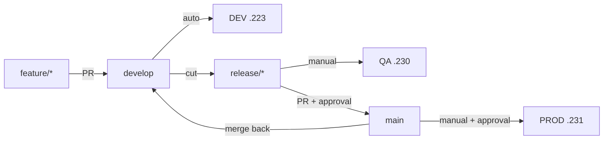

# Git workflow

## Branches

| Branch | Lives | Deploys to | Protected |
|---|---|---|---|
| `main` | Permanent | PROD | Yes |
| `develop` | Permanent | DEV | Yes |
| `feature/*` | Until merged | — | No |
| `bugfix/*` | Until merged | — | No |
| `release/*` | Until merged | QA | No |
| `hotfix/*` | Until merged | PROD (expedited) | No |

`main` always reflects what is in production. If they diverge, `main` is
wrong and that is an incident in itself — the whole audit trail depends on
that correspondence.

## Normal flow



```bash
git switch develop && git pull
git switch -c feature/invoice-export
# ... work ...
git push -u origin feature/invoice-export
gh pr create --base develop
```

Merging to `develop` triggers Build, then an automatic DEV deployment.

## Releasing

```bash
git switch -c release/1.4.0 develop
git push -u origin release/1.4.0
```

Then run **Deploy QA** with the tag Build produced. When QA passes:

```bash
gh pr create --base main --head release/1.4.0 --title "Release 1.4.0"
# after review and CI, merge, then:
git switch main && git pull
git tag -a v1.4.0 -m "Release 1.4.0" && git push origin v1.4.0
git switch develop && git merge main && git push
```

Run **Deploy PROD** with the **same tag QA validated**. Never a freshly built
one — that would discard the entire point of the promotion model.

## Hotfixes

```bash
git switch -c hotfix/1.4.1-session-fix main
# fix, test, push
gh pr create --base main
```

After merging to `main`, **merge back into `develop`** immediately. A hotfix
that exists only on `main` is silently reverted by the next release.

## Branch protection

Configure on `main` and `develop`:

- Require a pull request
- Require the status checks **CI passed** and **Security passed**
- Require branches to be up to date before merging
- Require at least one approving review
- Dismiss stale approvals on new commits
- Restrict force pushes and deletion

```bash
gh api -X PUT repos/:owner/:repo/branches/main/protection \
  -f 'required_status_checks[strict]=true' \
  -f 'required_status_checks[contexts][]=CI passed' \
  -f 'required_status_checks[contexts][]=Security passed' \
  -F 'enforce_admins=true' \
  -F 'required_pull_request_reviews[required_approving_review_count]=1' \
  -F 'required_pull_request_reviews[dismiss_stale_reviews]=true' \
  -F 'restrictions=null' \
  -F 'allow_force_pushes=false' \
  -F 'allow_deletions=false'
```

`CI passed` and `Security passed` are aggregate jobs. Adding a job to either
workflow **without adding it to that job's `needs:` list** makes it
non-blocking — the check would still be green while the new job failed.

## Commits

Conventional Commits, because the prefix drives the changelog and makes
`git log --oneline` scannable during an incident.

```
feat:     a new capability
fix:      a bug fix
docs:     documentation only
ci:       pipeline changes
infra:    Ansible, servers, networking
security: a security fix or control
refactor: no behaviour change
test:     tests only
chore:    maintenance
```

Explain **why** in the body, not what — the diff already says what.

## Identity

Commits must carry the author's real identity:

```bash
git config user.name  # Roshan Kumar Thapa
git config user.email # rthway@gmail.com
```

Never rewrite pushed history, never force-push a protected branch.
