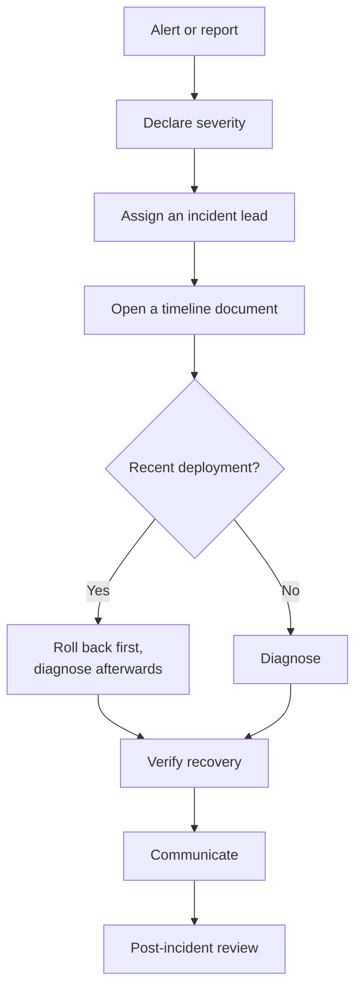

# Incident response

## Severity

| | Meaning | Example | Response |
|---|---|---|---|
| **SEV1** | Production down, or data at risk | Odoo unreachable; database corrupt; compromise | Immediate, all hands |
| **SEV2** | Production degraded | Severe slowness; a core feature broken | Within 1 hour |
| **SEV3** | Non-production, or minor | QA broken; cosmetic bug | Next working day |

When unsure between two levels, take the higher one. Downgrading later is
cheap; discovering an hour late that it was a SEV1 is not.

## First ten minutes



**If something was deployed in the last hour, roll back before diagnosing.**
Restoring service is the priority; root cause can wait until users are working
again.

```bash
tail -5 /opt/odoo-platform/.deploy-state/history.log
./scripts/rollback.sh -e prod --reason "SEV1 <symptom>"
```

## Roles

| Role | Does | Does not |
|---|---|---|
| **Incident lead** | Decides, coordinates, keeps the timeline | Debug personally |
| **Operator** | Runs commands, reports what happened | Act without the lead |
| **Communicator** | Updates stakeholders | Speculate on cause |

On a small team one person may hold several roles, but the lead role should
never be merged into deep debugging — someone has to keep altitude.

## Rules of engagement

1. **One person runs commands.** Two people fixing the same host concurrently
   is how a bad situation becomes worse.
2. **Announce before acting.** "I am restarting Odoo on .231 now."
3. **Write down what you did, as you do it.** Memory reconstructs badly.
4. **Preserve evidence before destroying it** — logs, a dump of the damaged
   database, container state.
5. **Never restore a backup as a reflex.** It is irreversible data loss and
   needs an explicit decision by someone authorised to accept it.

## Timeline template

```
INCIDENT: <one line>
SEVERITY: SEV1/2/3
STARTED:  <UTC>   DETECTED: <UTC>   RESOLVED: <UTC>
LEAD:     <name>

14:02  Deployed 2026.09.03-a1b2c3d to production
14:07  Alert: OdooDownProduction
14:09  Confirmed 502 from outside; containers running, Odoo unhealthy
14:11  Rolled back to 2026.09.01-9f8e7d6
14:14  Health checks pass; service restored
14:40  Cause: new module failed to import, missing pinned dependency

IMPACT:      ~7 minutes, all users
DATA LOSS:   none
ROOT CAUSE:  <why>
ACTIONS:     <what changes so it cannot recur>
```

## Common incidents

### Production is down

```bash
ssh deploy@157.10.100.231
cd /opt/odoo-platform
./scripts/healthcheck.sh -e prod       # what specifically is unhealthy
docker compose -f compose.yml -f compose.prod.yml ps
tail -5 .deploy-state/history.log      # recent deployment?
df -h                                  # disk full?
```

Then [`runbooks/application-down.md`](runbooks/application-down.md).

### Migration went wrong

Do **not** start Odoo and do not let users in. `migrate.sh` deliberately
leaves the stack stopped, because a half-migrated database serving users is
far worse than an outage with an intact backup.

See [`disaster-recovery.md`](disaster-recovery.md#scenario-2--bad-migration).

### Compromise suspected

1. **Isolate** — restrict the firewall to admin addresses. Do not power off;
   memory is evidence.
2. **Preserve** — snapshot disks, export Loki logs for the period.
3. **Rotate everything** — [`security.md`](security.md#rotation).
4. **Rebuild on new infrastructure.** Do not reuse the host.
5. **Restore from before the compromise began**, not from the latest backup.
6. Only reopen access after the entry path is understood.

### Data loss suspected

Stop writes immediately:

```bash
docker compose -f compose.yml -f compose.prod.yml stop odoo proxy
```

Take a dump of the current state **before** anything else — even a damaged
database is evidence, and it may contain data the backup does not.

## Communication

| Audience | When | Content |
|---|---|---|
| Internal team | Immediately | Everything |
| Stakeholders | Within 15 min for SEV1 | Impact, ETA if known, no speculation |
| Users | If user-visible | What is affected, what to do meanwhile |
| Follow-up | Within 24h of resolution | Cause, impact, prevention |

Say "we are investigating" rather than guessing a cause. A wrong cause
announced early costs more trust than a slower, accurate answer.

## Post-incident review

Within a week, for every SEV1 and SEV2. Blameless — the question is what in
the *system* allowed it, since people acting reasonably will make the same
call again.

Cover: what happened, timeline, why it took as long as it did to detect, why
it took as long as it did to fix, what made it worse, what made it better, and
concrete actions with owners.

Good actions are systemic:

- an alert that would have caught it sooner
- a CI assertion that would have blocked it
- a runbook step that was missing

Ending a review with "be more careful" means nothing has changed.

## Contacts

To be filled in before production go-live — see
[`disaster-recovery.md`](disaster-recovery.md#contacts).
