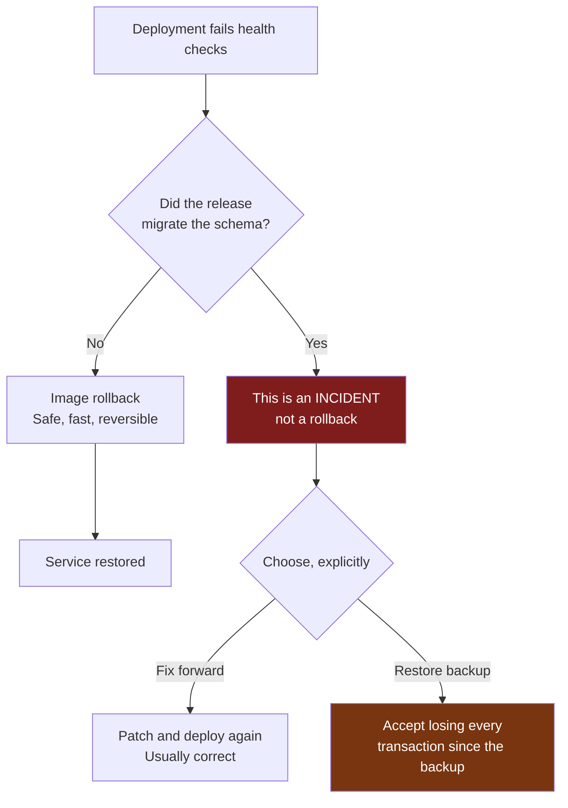

# Rollback

## What rollback does, and what it does not

`scripts/rollback.sh` reverts the **application image only**. It does not
touch the database, and that is deliberate.



Application rollback and database rollback are different problems with
different risk profiles:

- Reverting a container image is cheap, fast and reversible.
- Reverting a database that has already run an Odoo schema migration is
  **not**. Odoo migrations rewrite tables, drop columns and transform data.
  The only way back is restoring a pre-migration dump, which discards every
  transaction committed since it was taken.

So `rollback.sh` never restores a database automatically. Doing so silently
would turn a five-minute outage into irreversible data loss.

## Automatic rollback

`deploy.sh` rolls back on its own when health checks fail:

```
deploy tag N
  → health check fails
  → rollback to tag N-1 (from .deploy-state/previous)
  → health check the rolled-back version
  → pass: service restored, incident logged
  → fail: STOP and escalate
```

It deliberately does **not** keep cycling versions. Bouncing between two
broken releases turns a bad deployment into a prolonged outage, and the fault
is usually not the image at all — it is PostgreSQL, the disk, or a schema
that is now ahead of the code.

## Manual rollback

```bash
ssh deploy@157.10.100.231
cd /opt/odoo-platform

# To the recorded previous tag
./scripts/rollback.sh -e prod --reason "checkout errors after 1.4.0"

# To a specific tag
./scripts/rollback.sh -e prod -t 2026.09.01-9f8e7d6 --reason "..."
```

The script:

1. resolves the target tag (explicit, or `.deploy-state/previous`)
2. checks the image locally first, then pulls — during an incident the
   registry may also be unreachable
3. warns loudly about schema migrations in production
4. starts the target version
5. health-checks it, and escalates rather than looping if it is still unhealthy
6. records the rollback in `.deploy-state/history.log`

## After a rollback

Check what is actually running:

```bash
cat /opt/odoo-platform/.deploy-state/current
docker compose -f compose.yml -f compose.prod.yml ps
./scripts/healthcheck.sh -e prod
```

Then determine whether the schema was migrated:

```bash
# Modules whose state changed recently
docker compose -f compose.yml -f compose.prod.yml exec -T db \
  psql -U odoo_prod -d odoo_prod -tAc \
  "SELECT name, latest_version, write_date FROM ir_module_module
   WHERE write_date > now() - interval '1 day' ORDER BY write_date DESC LIMIT 20;"
```

If any module version changed in that window, **the schema moved** and the
rolled-back code is running against a newer schema. Treat it as an incident:
[`incident-response.md`](incident-response.md).

## Deciding: fix forward or restore

| | Fix forward | Restore backup |
|---|---|---|
| Data loss | None | Everything since the backup |
| Time | Minutes to hours | Restore duration (measured — see the Backup dashboard) |
| Risk | A second bad deploy | Known-good state, known data loss |
| Use when | The app is degraded but usable, or the fix is small | Data is corrupted, or the app is unusable |

**Fix forward is usually correct.** Restoring is the right call only when the
data itself is damaged, and it needs an explicit decision by someone
authorised to accept the loss — never a reflex.

## Rollback is only possible if state is tracked

`.deploy-state/` is what makes rollback a lookup rather than guesswork:

| File | Holds |
|---|---|
| `current` | Tag running now |
| `previous` | Last tag that passed health checks |
| `history.log` | Every deploy, rollback and migration, with digests and backup sets |

`previous` is only written **after** health checks pass, so it always names a
tag that was genuinely healthy at some point. That is the entire value of it.

If `.deploy-state/` is lost, find the tag from the history log or from
Docker Hub and pass it with `-t`.

## Testing rollback

Rollback that has never been exercised is a hypothesis. Rehearse it on QA:

```bash
./scripts/deploy.sh   -e qa -t <older-tag>
./scripts/deploy.sh   -e qa -t <newer-tag>
./scripts/rollback.sh -e qa --reason "rollback rehearsal"
./scripts/healthcheck.sh -e qa
```

> **Status: not yet performed.** No environment has been deployed, so no
> rollback has been tested. This is listed as outstanding in the README.
