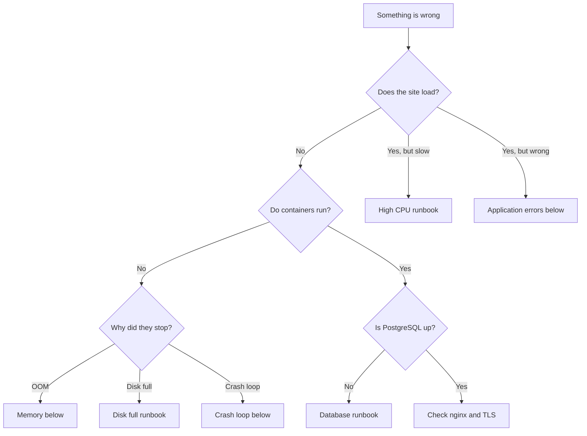

# Troubleshooting

Symptom first. For a full incident, start at
[`incident-response.md`](incident-response.md).

## Triage



## First five commands

```bash
cd /opt/odoo-platform
E=prod; DC="docker compose -f compose.yml -f compose.$E.yml"

$DC ps                              # what is running
./scripts/healthcheck.sh -e $E      # what is actually healthy
df -h                               # disk is the usual culprit
tail -5 .deploy-state/history.log   # was something just deployed?
$DC logs --since 30m odoo | grep -iE 'error|traceback' | head -20
```

The fourth is the one people skip. "It broke at 14:03" is very often "we
deployed at 14:02".

## The site does not load

```bash
$DC ps                      # are all three up?
$DC logs --tail 50 proxy    # is nginx the problem?
$DC logs --tail 50 odoo
# HTTPS: every environment serves on 443, and port 80 only redirects.
# -k because DEV/QA (and PROD until it has a DNS name) are self-signed.
curl -skv https://127.0.0.1/web/health
```

| Finding | Meaning |
|---|---|
| nginx up, Odoo down | Application fault — read Odoo's logs |
| nginx down | Config error or TLS problem; `$DC exec proxy nginx -t` |
| Both up, 502 | Odoo is listening but not answering; usually still starting |
| Connection refused from outside | Firewall, or `BIND_ADDRESS` is `127.0.0.1` |

## Containers keep restarting

```bash
docker inspect --format '{{.RestartCount}} {{.State.Status}}' <container>
$DC logs --tail 100 <service>
docker inspect --format '{{.State.OOMKilled}}' <container>
```

`OOMKilled: true` means the memory limit was hit. Either the limit is too low
or `ODOO_LIMIT_MEMORY_HARD` is above the container limit — the container limit
must always be the larger of the two, or Docker kills the worker before Odoo
can recycle it gracefully.

## Memory

```bash
free -h
docker stats --no-stream
$DC exec -T db psql -U odoo_prod -d odoo_prod -c "SHOW shared_buffers;"
```

Odoo workers grow over time; `limit_memory_soft` recycles them, which is
normal and healthy. Restarts caused by the *hard* limit are not.

Rough budget: PostgreSQL `shared_buffers` ≈ 25% of RAM, Odoo workers ≈ 400 MB
to 1 GB each, plus headroom for the page cache.

## Slow

```bash
# Which query?
$DC exec -T db psql -U odoo_prod -d odoo_prod -c \
  "SELECT calls, round(mean_exec_time::numeric,1) AS avg_ms, left(query,80)
   FROM pg_stat_statements ORDER BY total_exec_time DESC LIMIT 10;"

# Blocked on a lock?
$DC exec -T db psql -U odoo_prod -d odoo_prod -c \
  "SELECT pid, wait_event_type, wait_event, left(query,60)
   FROM pg_stat_activity WHERE wait_event_type='Lock';"
```

Check the Odoo dashboard for response time and the PostgreSQL dashboard for
cache hit ratio. Below 0.95 usually means `shared_buffers` is too small, or a
query is sequentially scanning a table that needs an index.

## Application errors

```bash
$DC logs --since 1h odoo | grep -B5 -A20 Traceback | head -80
```

| Error | Usual cause |
|---|---|
| `psycopg2.OperationalError` | Database unreachable or out of connections |
| `Session expired` | `proxy_mode` wrong, or the session store was cleared |
| `AccessDenied` | Odoo permissions, not infrastructure |
| `MissingError` | Record deleted mid-transaction |
| `Registry not loaded` | Module failed to import — check the startup log |

## Wrong URLs, broken password-reset links

Almost always `proxy_mode`:

```bash
$DC exec odoo grep proxy_mode /etc/odoo/odoo.conf     # must be True
$DC exec proxy grep -r X-Forwarded-Proto /etc/nginx/
```

Without it, Odoo builds `http://` links behind an HTTPS proxy and emails send
users to an address that does not work.

## Database manager reachable

A security issue — act immediately.

```bash
curl -s -o /dev/null -w '%{http_code}\n' https://<host>/web/database/manager
# must be 404 or 403 in QA and PROD
```

If it returns 200, check `ODOO_LIST_DB` in `.env` and the nginx location
block, then redeploy. The entrypoint should have refused to start at all —
if it did not, `ENVIRONMENT` is set to `dev` on a non-dev host.

## Backups

```bash
tail -50 /var/backups/odoo/backup.log
ls -1dt /var/backups/odoo/prod/*/ | head -5
./scripts/verify-backup.sh -s <set> --checksums
```

See [`runbooks/backup-failed.md`](runbooks/backup-failed.md).

## Monitoring gaps

| Symptom | Check |
|---|---|
| Target `DOWN` in Prometheus | ufw allows 9100/9187/8081 from `.232`? |
| No logs in Loki | `docker logs promtail`; can it reach `.232:3100`? |
| Alerts not delivered | `amtool config routes test`; is Alertmanager up? |
| Dashboard empty | Is the datasource resolving? Does the metric exist in Prometheus? |

## When to escalate

- Data loss is suspected
- A schema migration went wrong
- Compromise is suspected
- Rollback did not restore health
- More than 30 minutes without a working hypothesis

Go to [`incident-response.md`](incident-response.md).
